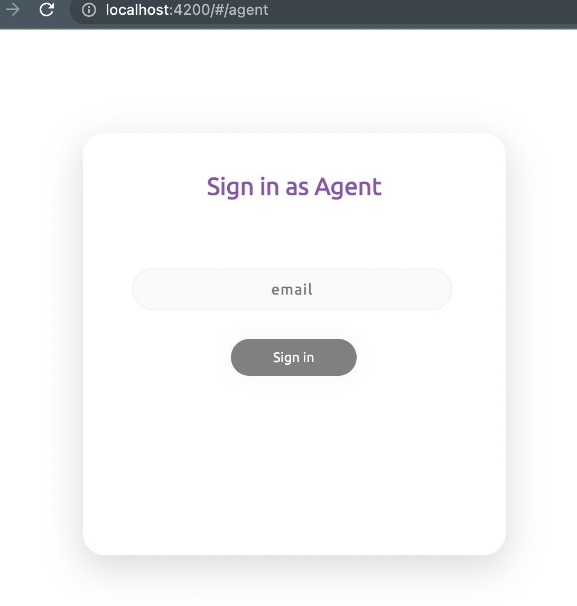
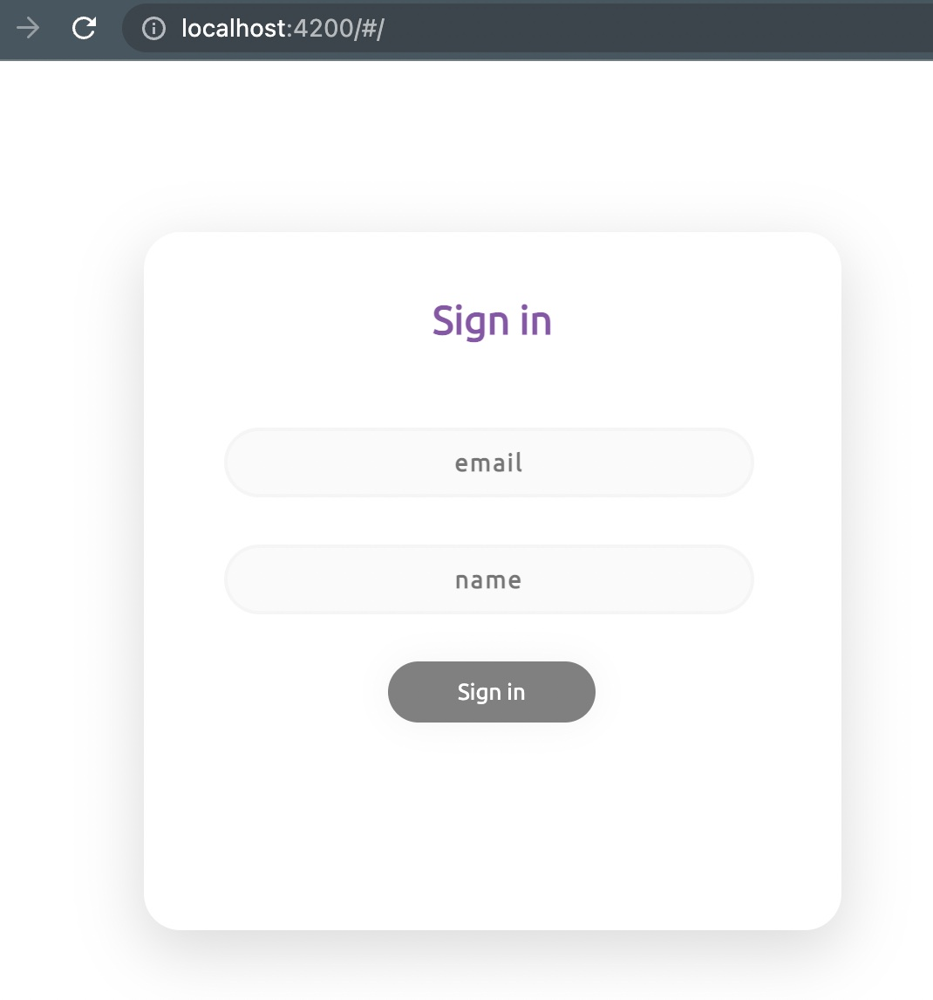
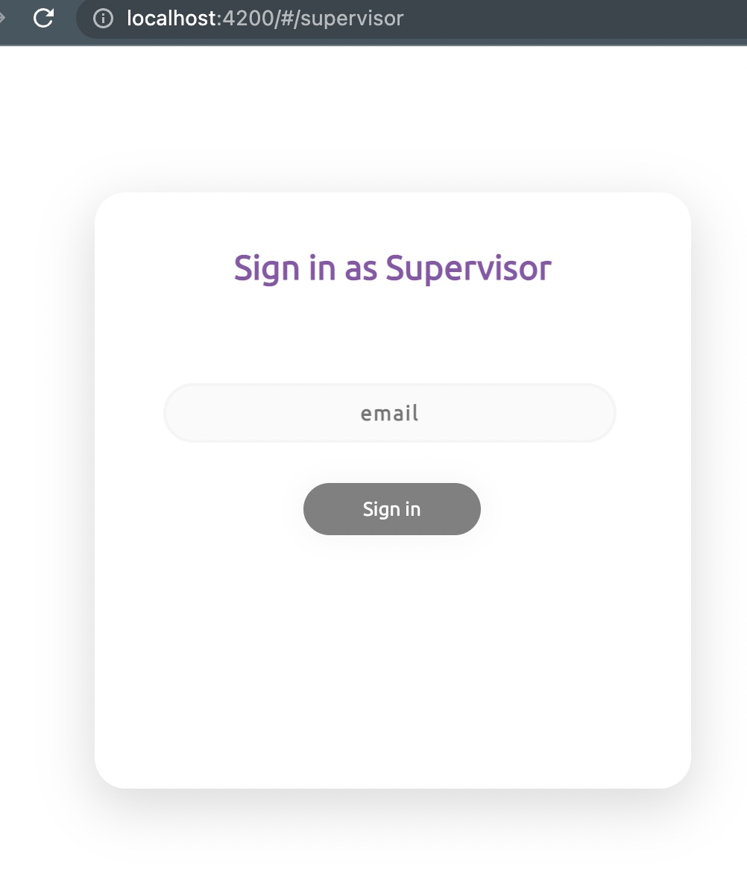

# QcChat

This project was base on Angular v12.2.1.

## Environment Variable
- API_URL - do `export API_URL=http://localhost:8000` on your terminal

## Available URL
- `http://localhost:4200` will act as customer / user
- `http://localhost:4200/#/agent` will act as agent
- `http://localhost:4200/#/supervisor` will act as supervisor

###
- customer will be the one to initiate chat, just fill the form `name, email`
> 
- agent will act as a customer service-ish
> 
- supervisor will act as PIC to assign agent to handle customer
> 

## Development server

Run `ng serve` for a dev server. Navigate to `http://localhost:4200/`. The app will automatically reload if you change any of the source files.

## Build

Run `ng build` | `ng build --prod` to build the project. The build artifacts will be stored in the `dist/` directory.

## Running unit tests

Run `ng test` to execute the unit tests via [Karma](https://karma-runner.github.io).

## Running end-to-end tests

Run `ng e2e` to execute the end-to-end tests via a platform of your choice. To use this command, you need to first add a package that implements end-to-end testing capabilities.
